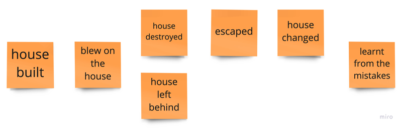
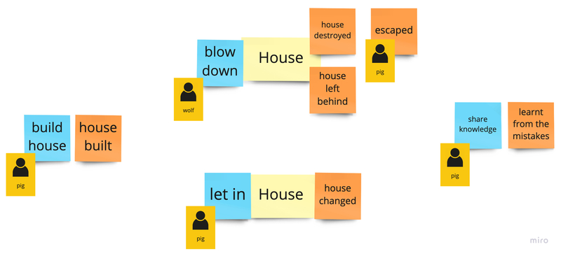
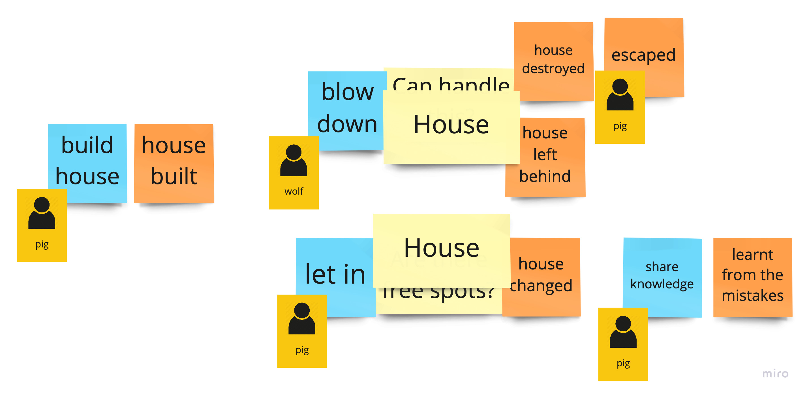

# _The Three Little Pigs_ with DDD and clean architecture

[My tech talk](https://github.com/mat3e/talks/tree/master/docs/3pigs), fairy tale sources: [1](https://www.gillbooks.ie/AcuCustom/Sitename/DAM/101/WWSI_OM_0902.pdf), [2](http://www.hellokids.com/c_14958/reading-learning/stories-for-children/animal-stories-for-kids/the-three-little-pigs), [3](https://sacred-texts.com/neu/eng/eft/eft15.htm), [4](https://americanliterature.com/childrens-stories/the-three-little-pigs).

> Java 17, Groovy + Spock, Kotlin, Maven, Spring

## Web app
App starts as an ordinary web app for
```properties
spring.main.web-application-type=servlet
```

Available operations:
1. Build house: `POST` `localhost:8080/houses`
   ```json
    {
        "owner": "VERY_LAZY"
    }
    ```
   Possible values for `owner`: 
   * `VERY_LAZY`
   * `LAZY`
   * `NOT_LAZY`
   * `NOT_LAZY_ANYMORE`
1. Verify the house state: `GET` `localhost:8080/houses/{id}`
1. Blow house down: `DELETE` `localhost:8080/houses/{id}`

There is a dedicated [Postman](https://www.postman.com/) collection with all these operations already defined: `adapters/src/main/resources/3Pigs.postman_collection.json`

## Console app
When
```properties
spring.main.web-application-type=none
```
app prints the whole story in the console.

---

## EventStorming
An example.

### Big Picture


### Design Level - commands, rules & actors


### Design Level - naming aggregates


## Possible improvements
* `House` could have mechanisms for rebuilding
* Story can be extended - currently there is nothing about wolf climbing through the chimney and pigs lighting the fire
   * New `House` method, e.g. `litFire`
   * New `BigBadWolfService` method, e.g. `comeDownTheChimneyOf`
   * Event, e.g. `WolfStartedClimbing` instead of `WolfResignedFromAttacking`, new event from `House`, e.g. `WolfEscaped` (when burns in the fireplace)
   * `WolfStartedClimbing` should call both `litFire` and `comeDownTheChimneyOf` in a proper order
   * `WolfEscaped` should result in knowledge sharing
* Full Event Sourcing - `House` can be built just from events, no snapshots in the current form
