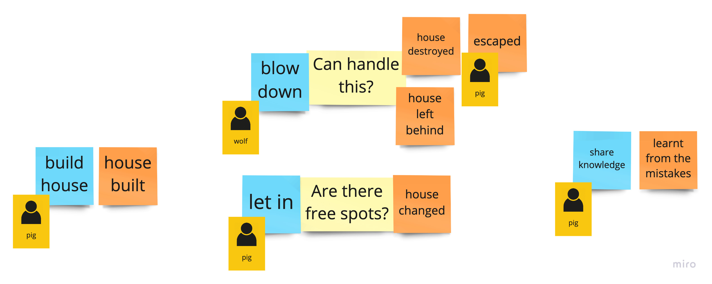

# _The Three Little Pigs_ with DDD and clean architecture

[My tech talk](https://github.com/mat3e/talks/tree/master/docs/3pigs), fairy tale
sources: [1](https://www.gillbooks.ie/AcuCustom/Sitename/DAM/101/WWSI_OM_0902.pdf), [2](http://www.hellokids.com/c_14958/reading-learning/stories-for-children/animal-stories-for-kids/the-three-little-pigs), [3](https://sacred-texts.com/neu/eng/eft/eft15.htm), [4](https://americanliterature.com/childrens-stories/the-three-little-pigs).

> Java, Groovy + Spock, Kotlin, Maven, Spring

The main focus should be on _The Three Little Pigs_, but to show an alternative, more pragmatic approach there is also
_The Red Riding Hood_ module, utilizing package-private access more, close to what's presented
in [this great tech talk by Jakub Nabrdalik](https://www.youtube.com/watch?v=KrLFs6f2bOA).

## Web app

App starts as an ordinary web app for

```properties
spring.main.web-application-type=servlet
```

### _The Three Little Pigs_

Available operations:

1. Build house: `POST` `localhost:8080/houses`
   ```json
    {
        "owner": "VERY_LAZY"
    }
    ```
   Possible values for `owner`:
    * `VERY_LAZY`
    * `LAZY`
    * `NOT_LAZY`
    * `NOT_LAZY_ANYMORE`
2. Verify the house state: `GET` `localhost:8080/houses/{id}`
3. Blow house down: `DELETE` `localhost:8080/houses/{id}`

There is a dedicated [Postman](https://www.postman.com/) collection with all these operations already
defined: `pigs3/adapters/src/main/resources/3Pigs.postman_collection.json`.

### _The Red Riding Hood_

There is a dedicated [Postman](https://www.postman.com/) collection with all the operations ready to
use: `redhood/src/main/resources/RedHood.postman_collection.json`.

## Console app

When

```properties
spring.main.web-application-type=none
```

app prints the whole _The Three Little Pigs_ story in the console.

---

## EventStorming

An example session with myself, for _The Three Little Pigs_. There was no need to run Process Level ES as we already had
a single BoundedContext, and it was doable to jump straight into Design Level.

For the second module I also run Big Picture ES which helped to realize that the main things are interactions and wolf's
intentions.

### Big Picture


### Design Level - commands, rules & actors



### Design Level - naming aggregates


## Possible improvements

* `House` could have mechanisms for rebuilding
* Story can be extended - currently there is nothing about wolf climbing through the chimney and pigs lighting the fire
    * New `House` method, e.g. `litFire`
    * New `BigBadWolfService` method, e.g. `comeDownTheChimneyOf`
    * Event, e.g. `WolfStartedClimbing` instead of `WolfResignedFromAttacking`, new event from `House`,
      e.g. `WolfEscaped` (when burns in the fireplace)
    * `WolfStartedClimbing` should call both `litFire` and `comeDownTheChimneyOf` in a proper order
    * `WolfEscaped` should result in knowledge sharing
* Full Event Sourcing - `House` can be built just from events, no snapshots in the current form
* Rely fully on `DomainEventPublisher` - although `@DomainEvents` annotation looks
  nice, it relies on `ApplicationEventPublisher` which has known limitations, especially without additional tooling
  like [Spring Modulith](https://spring.io/blog/2022/10/21/introducing-spring-modulith)
* Instead of "technical" packages corresponding with Clean Architecture and DDD, there could be more process-oriented
  packages, like `building` (or `construcitng`) and `destroying`, where the domain logic would lay, similar as presented
  in [this great tech talk by Victor Rentea](https://www.youtube.com/watch?v=H7HWOlANX78)
